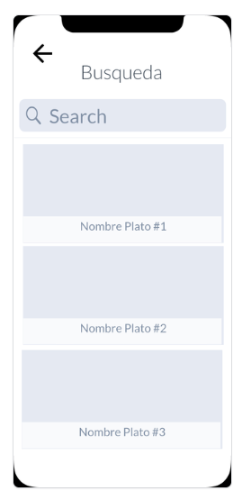

# Diseño de interfaz de usuario

   

En la siguiente URL encontrará el Mockup funcional:

   

La interfaz de usuario de la aplicación CookMaster esta inspirada en la mayoria de interfaces diseñadas y optimizadas para este tipo de aplicaciones.
Se diseñara una interfaz sencilla y practica que vaya directo al objetivo de la aplicación: Enseñar a cocinar recetas.

En principio los colores estaran basados en tonalidades azules claros, morados con mucha luz y tonalidades blancas (El diseño de la app esta pensado para ser usado en Modo Claro durante el desarrollo)
A continuación se presentaran las principales pantallas:

1. Menu principal

   La pantalla principal de la app se vera un grid con los principales platos de nuestra base de datos pero, si el usuario lo desea podrá ver al iniciar la app su ventana de Favoritos donde tendra a mano todos los
   que ha ido seleccionando como sus favoritos.

   

2. Panel de Opciones

   Adicionalmente el usuario podrá ver deslizando desde la izquierda, un panel de opciones desde el cual tendra disponible todas las caracteristicas de nuestra aplicacion, desde sus apartados favoritos hasta una
   lista de compra.

   

3. Vista de busqueda

   La vista de busqueda mostrara un listado de las opciones solicitadas a la API segun la palabra clave escrita en la caja de texto

   

4. Vista de la receta.

   Ya una vez el usuario se decide por una receta, al acceder a la misma se encontrara ya en una vista mas en detalle de la comida. Es en esta ventana donde encontrará una descripcion de la receta, sus ingredientes,
   una calificacion de los usuarios, su tienpo de preparacion y finalmente el paso a paso para realizarlo.

   

5. Vista de Panel de usuario.

   Este será el panel de usuario donde el mismo usuario podrá ver información relevante sobre su propia cuenta en la plataforma.

   

6. Vista de favoritos.

   Este panel nos encontraremos con el panel de favoritos, donde el usuario podra encontrar las tarjetas de las recetas que ellos hayan seleccionado como sus favoritos.

   